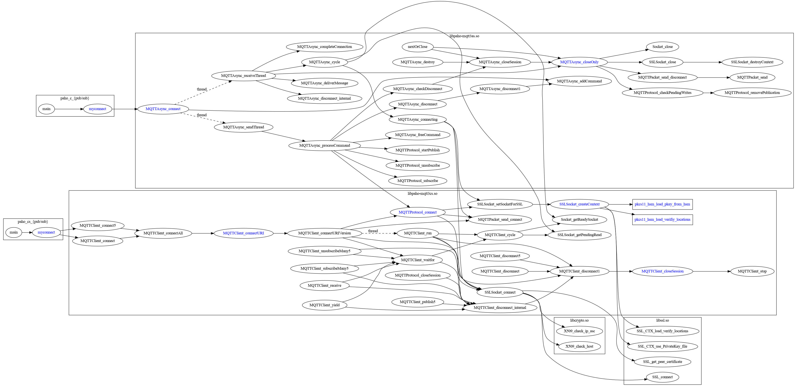

# Paho PKCS11\_HSM extension

The Paho PKCS11\_HSM extension project aims to provide an PKCS11 interface to the Paho MQTT C Client library. By doing so, the Paho library can directly interact with HSM to fetch the materials such as certificates and keys instead of the file system in the original implementation.


## Objective
------

* <b>Compatibility</b> - By adding the PKCS11\_HSM extension, the Paho library is still able to provide the exising file system interface. Both the HSM interface and the file system interface will be supported by the new Paho library.

* <b>Manageability</b> - The modification should be minimal from the original code base for the easy code management.


## Dependency
------

This source code uses the [libp11 PKCS11 library](https://github.com/OpenSC/libp11) from the Open Smart Card project.


## API modification
------

The Paho MQTT C Client consists of syncronous APIs and asyncronous APIs. The new application inputs are added into the following data structures. The first five arguments should be passed from the application and the rest three arguments are used internally to store the allocated resources that pass through the function calls.

```c
typedef struct
{
...
    /* parameters passed from the application */
    const char* hsmModule;
    const char* caLabel;
    const char* keyLabel;
    const char* tokenLabel;
    const char* pinValue;
    /* parameters to access the HSM */
    PKCS11_CTX *pkcs11_ctx;
    PKCS11_SLOT *pkcs11_slots;
    unsigned int pkcs11_slot_num;
...
} MQTTClient_SSLOptions;


typedef struct
{
...
    /* parameters passed from the application */
    const char* hsmModule;
    const char* caLabel;
    const char* keyLabel;
    const char* tokenLabel;
    const char* pinValue;
    /* parameters to access the HSM */
    PKCS11_CTX *pkcs11_ctx;
    PKCS11_SLOT *pkcs11_slots;
    unsigned int pkcs11_slot_num;
...
} MQTTAsync_SSLOptions;
```

There are the sample programs within './src/sample' directory. 'paho_cs_pub' and 'paho_cs_sub' are the syncronous version of MQTT client for publisher and subscriber, while 'paho_c_pub' and 'paho_c_sub' are the asyncronous version of MQTT client. As shown below, the five new arguments are added into these four sample programs.

```
Usage: paho_cs_pub [topicname] [-t topic] [-c connection] [-h host] [-p port]
       [-q qos] [-i clientid] [-u username] [-P password] [-k keepalive_timeout]
       [-V MQTT-version] [--quiet] [--trace trace-level]
       [-r] [-n] [-m message] [-f filename]
       [--maxdatalen len] [--message-expiry seconds] [--user-property name value]
       [--will-topic topic] [--will-payload message] [--will-qos qos] [--will-retain]
       [--cafile filename] [--capath dirname] [--cert filename] [--key filename]
       [--keypass string] [--ciphers string] [--insecure]
       [--hsmmodule string] [--calabel string] [--keylabel string]
       [--tokenlabel string] [--pin string]

  --hsmmodule         : path of HSM library.
  --calabel           : ca label to retrive from HSM.
  --keylabel          : client private key label to retrieve from HSM.
  --tokenlabel        : token label where ca and key are stored.
  --pin               : pin value to retrieve from HSM.

```


## Function call modification
------
The list of modified files from the original Paho MQTT C Client is shown [here](./change_file.log).

The following figure illustrates the call graphs with the modified functions in this source code. The changed functions are marked with the blue color. While the ellipses depict the exising functions in the original source code, the rectangular boxes depict the newly created functions.




## Build instruction
------

In the 'Makefile', the following line should be edited to enable PKCS11_HSM support.

```
...
# PKCS11_HSM Configuration
# - the following flags should be adjusted to build with PKCS11_HSM support
# - leaving blank will disable PKCS11_HSM support
PKCS11_ENABLED = ON
#
...
```

When all is ready, the code can be built with 'make'. When it is successful, all the library files will be created under './build/output' and all the sample programs will be created under './build/output/sample'.
